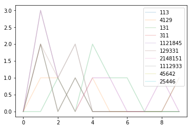

### Goal
Given a list of numbers, I find the digit distribution of each number

### Motivation
I want to compare the similarity of an abritrary list of elements by their "digital signatures", which is characterized by numbers. 

Example: 2900 and 9020 have are digital anagrams because they the same count of digits, whereas 299 and 29 are not anagrams because they don't have the same number of each of their base digits. Anagrams have the same digital signature.

### Details
By graphing the distrubution of digits for each number, we can quickly see the unique distributions. Furthermore, if I know the distribution of each number, I can filter them out for further comparison.


```python
from matplotlib import pyplot as plt
import seaborn as sns
import pandas as pd
%matplotlib inline  
```


```python
nums = [113, 4129, 131, 311, 1121845, 129331, 2148151, 1112933, 45642, 25446]

anagrams = {} # use count of digital signatures
base = {el: 0 for el in '0123456789'} # use to count digits

df_dict = {}
df_dict['dist_arr'] = []
df_dict['num'] = []

for num in nums:
    print(num)
    dist_dict = base.copy() # digit count 
    dist_arr = [0]*10
    
    for digit in str(num):
        dist_dict[digit] += 1
        dist_arr[int(digit)] += 1
        
    print(dist_dict)
    print(dist_arr)

    hist = "".join([str(v) for k,v in dist_dict.items()])
    print(hist)
    if hist in anagrams:
        anagrams[hist] += 1
    else:
        anagrams[hist] = 1
    
    # form data for a dataframe later
    df_dict['num'].append(num)
    df_dict['dist_arr'].append(dist_arr)

    
print(anagrams)
print()
print(df_dict)
```

    113
    {'0': 0, '1': 2, '2': 0, '3': 1, '4': 0, '5': 0, '6': 0, '7': 0, '8': 0, '9': 0}
    [0, 2, 0, 1, 0, 0, 0, 0, 0, 0]
    0201000000
    4129
    {'0': 0, '1': 1, '2': 1, '3': 0, '4': 1, '5': 0, '6': 0, '7': 0, '8': 0, '9': 1}
    [0, 1, 1, 0, 1, 0, 0, 0, 0, 1]
    0110100001
    131
    {'0': 0, '1': 2, '2': 0, '3': 1, '4': 0, '5': 0, '6': 0, '7': 0, '8': 0, '9': 0}
    [0, 2, 0, 1, 0, 0, 0, 0, 0, 0]
    0201000000
    311
    {'0': 0, '1': 2, '2': 0, '3': 1, '4': 0, '5': 0, '6': 0, '7': 0, '8': 0, '9': 0}
    [0, 2, 0, 1, 0, 0, 0, 0, 0, 0]
    0201000000
    1121845
    {'0': 0, '1': 3, '2': 1, '3': 0, '4': 1, '5': 1, '6': 0, '7': 0, '8': 1, '9': 0}
    [0, 3, 1, 0, 1, 1, 0, 0, 1, 0]
    0310110010
    129331
    {'0': 0, '1': 2, '2': 1, '3': 2, '4': 0, '5': 0, '6': 0, '7': 0, '8': 0, '9': 1}
    [0, 2, 1, 2, 0, 0, 0, 0, 0, 1]
    0212000001
    2148151
    {'0': 0, '1': 3, '2': 1, '3': 0, '4': 1, '5': 1, '6': 0, '7': 0, '8': 1, '9': 0}
    [0, 3, 1, 0, 1, 1, 0, 0, 1, 0]
    0310110010
    1112933
    {'0': 0, '1': 3, '2': 1, '3': 2, '4': 0, '5': 0, '6': 0, '7': 0, '8': 0, '9': 1}
    [0, 3, 1, 2, 0, 0, 0, 0, 0, 1]
    0312000001
    45642
    {'0': 0, '1': 0, '2': 1, '3': 0, '4': 2, '5': 1, '6': 1, '7': 0, '8': 0, '9': 0}
    [0, 0, 1, 0, 2, 1, 1, 0, 0, 0]
    0010211000
    25446
    {'0': 0, '1': 0, '2': 1, '3': 0, '4': 2, '5': 1, '6': 1, '7': 0, '8': 0, '9': 0}
    [0, 0, 1, 0, 2, 1, 1, 0, 0, 0]
    0010211000
    {'0201000000': 3, '0110100001': 1, '0310110010': 2, '0212000001': 1, '0312000001': 1, '0010211000': 2}
    
    {'dist_arr': [[0, 2, 0, 1, 0, 0, 0, 0, 0, 0], [0, 1, 1, 0, 1, 0, 0, 0, 0, 1], [0, 2, 0, 1, 0, 0, 0, 0, 0, 0], [0, 2, 0, 1, 0, 0, 0, 0, 0, 0], [0, 3, 1, 0, 1, 1, 0, 0, 1, 0], [0, 2, 1, 2, 0, 0, 0, 0, 0, 1], [0, 3, 1, 0, 1, 1, 0, 0, 1, 0], [0, 3, 1, 2, 0, 0, 0, 0, 0, 1], [0, 0, 1, 0, 2, 1, 1, 0, 0, 0], [0, 0, 1, 0, 2, 1, 1, 0, 0, 0]], 'num': [113, 4129, 131, 311, 1121845, 129331, 2148151, 1112933, 45642, 25446]}
    


```python
df = pd.DataFrame(df_dict)
df[['0','1','2','3','4','5','6','7','8','9']] = pd.DataFrame(df['dist_arr'].tolist(), index=df.index)
df
```


<div>
<style scoped>
    .dataframe tbody tr th:only-of-type {
        vertical-align: middle;
    }

    .dataframe tbody tr th {
        vertical-align: top;
    }

    .dataframe thead th {
        text-align: right;
    }
</style>
<table border="1" class="dataframe">
  <thead>
    <tr style="text-align: right;">
      <th></th>
      <th>dist_arr</th>
      <th>num</th>
      <th>0</th>
      <th>1</th>
      <th>2</th>
      <th>3</th>
      <th>4</th>
      <th>5</th>
      <th>6</th>
      <th>7</th>
      <th>8</th>
      <th>9</th>
    </tr>
  </thead>
  <tbody>
    <tr>
      <td>0</td>
      <td>[0, 2, 0, 1, 0, 0, 0, 0, 0, 0]</td>
      <td>113</td>
      <td>0</td>
      <td>2</td>
      <td>0</td>
      <td>1</td>
      <td>0</td>
      <td>0</td>
      <td>0</td>
      <td>0</td>
      <td>0</td>
      <td>0</td>
    </tr>
    <tr>
      <td>1</td>
      <td>[0, 1, 1, 0, 1, 0, 0, 0, 0, 1]</td>
      <td>4129</td>
      <td>0</td>
      <td>1</td>
      <td>1</td>
      <td>0</td>
      <td>1</td>
      <td>0</td>
      <td>0</td>
      <td>0</td>
      <td>0</td>
      <td>1</td>
    </tr>
    <tr>
      <td>2</td>
      <td>[0, 2, 0, 1, 0, 0, 0, 0, 0, 0]</td>
      <td>131</td>
      <td>0</td>
      <td>2</td>
      <td>0</td>
      <td>1</td>
      <td>0</td>
      <td>0</td>
      <td>0</td>
      <td>0</td>
      <td>0</td>
      <td>0</td>
    </tr>
    <tr>
      <td>3</td>
      <td>[0, 2, 0, 1, 0, 0, 0, 0, 0, 0]</td>
      <td>311</td>
      <td>0</td>
      <td>2</td>
      <td>0</td>
      <td>1</td>
      <td>0</td>
      <td>0</td>
      <td>0</td>
      <td>0</td>
      <td>0</td>
      <td>0</td>
    </tr>
    <tr>
      <td>4</td>
      <td>[0, 3, 1, 0, 1, 1, 0, 0, 1, 0]</td>
      <td>1121845</td>
      <td>0</td>
      <td>3</td>
      <td>1</td>
      <td>0</td>
      <td>1</td>
      <td>1</td>
      <td>0</td>
      <td>0</td>
      <td>1</td>
      <td>0</td>
    </tr>
    <tr>
      <td>5</td>
      <td>[0, 2, 1, 2, 0, 0, 0, 0, 0, 1]</td>
      <td>129331</td>
      <td>0</td>
      <td>2</td>
      <td>1</td>
      <td>2</td>
      <td>0</td>
      <td>0</td>
      <td>0</td>
      <td>0</td>
      <td>0</td>
      <td>1</td>
    </tr>
    <tr>
      <td>6</td>
      <td>[0, 3, 1, 0, 1, 1, 0, 0, 1, 0]</td>
      <td>2148151</td>
      <td>0</td>
      <td>3</td>
      <td>1</td>
      <td>0</td>
      <td>1</td>
      <td>1</td>
      <td>0</td>
      <td>0</td>
      <td>1</td>
      <td>0</td>
    </tr>
    <tr>
      <td>7</td>
      <td>[0, 3, 1, 2, 0, 0, 0, 0, 0, 1]</td>
      <td>1112933</td>
      <td>0</td>
      <td>3</td>
      <td>1</td>
      <td>2</td>
      <td>0</td>
      <td>0</td>
      <td>0</td>
      <td>0</td>
      <td>0</td>
      <td>1</td>
    </tr>
    <tr>
      <td>8</td>
      <td>[0, 0, 1, 0, 2, 1, 1, 0, 0, 0]</td>
      <td>45642</td>
      <td>0</td>
      <td>0</td>
      <td>1</td>
      <td>0</td>
      <td>2</td>
      <td>1</td>
      <td>1</td>
      <td>0</td>
      <td>0</td>
      <td>0</td>
    </tr>
    <tr>
      <td>9</td>
      <td>[0, 0, 1, 0, 2, 1, 1, 0, 0, 0]</td>
      <td>25446</td>
      <td>0</td>
      <td>0</td>
      <td>1</td>
      <td>0</td>
      <td>2</td>
      <td>1</td>
      <td>1</td>
      <td>0</td>
      <td>0</td>
      <td>0</td>
    </tr>
  </tbody>
</table>
</div>


```python
df.loc[[0]]
plt.cla()
for i,el in df.iterrows():
    plt.plot(el['dist_arr'], alpha=0.2, label=el['num'])
    
plt.legend(loc='upper right')
plt.show()
```




